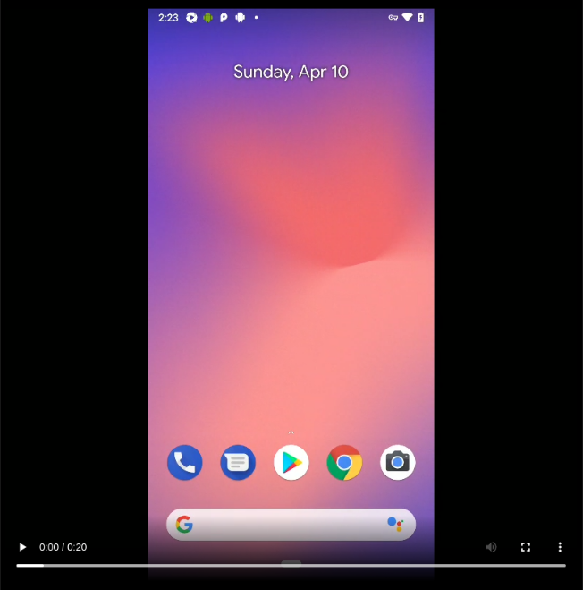

# Проект автотестов на мобильное приложение Wikipedia
Проект создан в рамках обучения в школе QA.GURU и представляет из себя часть выпускной работы.

Использованны слудующие технологии:
<p align="center">


</p>

# Описание проекта
Автоматизирована проверка экрана онбординга в мобильном приложении Wikipedia.
Для конфигурации запуска теста используется библиотека Owner. С помощью нее настроен запуск на разных устройствах.

Конфигурация устройства задается в специальном файле, а при запуске тестов используется параметр для выбора конкретного файла конфигурации.
При этом, тесты могут работать без изменения кодовой базы:
- с удаленным устройством в Browserstack,
- с локальным эмулятором устройства через Android Studio,
- с реальным устройством подключенным к машине, где осуществляется запуск тестов.

# Запуск тестов
Запуск осуществляется командой: 
```
gradle clean test -Ddevice=emulator
```
Где:
`-Ddevice` - параметр отвечающий за выбор устройства для запуска тестов. 
В значение данного параметра передается название файла настроек девайса. Например: "local". Тогда конфигуратор тестов
будет искать в ресурсах файл настроек с именем "local.properties" и использовать его для настройки девайса.

Если же передается "remote", то используются настройки для работы с Browserstack.

Для запуска тестов в Jenkins используется следующая команда:
```
clean
test
-DappUrl=${APPURL}
-DbrowserstackUrl=${BROWSERSTACKURL}
-Ddevice=remote
```
Где:

`-Ddevice=remote` - так как в Jenkins нет подключенных устройств, то тесты принудительно запускаются на проекте Browserstack,

`${APPURL}` - адрес-идентификатор приложения википедии в Browserstack,

`${BROWSERSTACKURL}` - адрес Browserstack.

# Запуск тестов в Jenkins выглядит следующим образом
Главная страница сборки


Выбор параметров сборки


Работа сборки


Отчет о выполнении тестов


Каждый тест, независимо от результата, состоит из:
- начальных параметров,
- шагов, 
- скриншота браузера,
- исходного кода страницы,
- лога консоли браузера,
- видео выполнения теста.


Пример скриншота


# Пример прохождения теста на удаленной машине (клик для просмотра)
[](media/TestRun.mp4)

# Результаты работы тестов в Browserstack


# По резултатам работы тестов отправляется краткий отчет в Telegram


# Создан проект в Allure TestOps
Тесты в проекте импортированы из кода, то есть не приходится писать тесты и автоматизировать их.
Достаточно написать автотест, а кейс в TMS всегда будет в актуальном состоянии. 


# Настроена интеграция Jenkins и Allure TestOps
Запуск джоб осуществляется из интерфейса Allure TestOps


Результаты работы джоб также отображаются в Allure TestOps


# Настроен дашборд с разными показателями
Отображаются графики тренда автоматизации, последний запуск и т.д.


